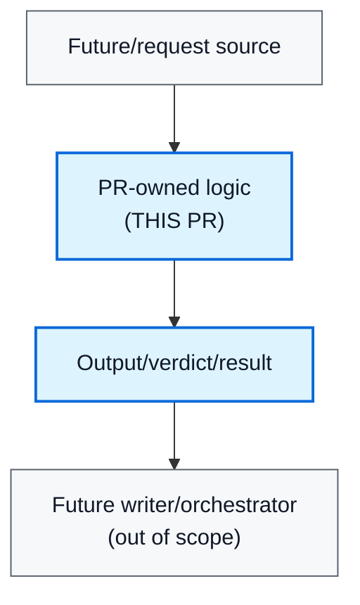

# Pr Body From Spec

## Overview

Use this skill to turn messy implementation context into a PR body that reviewers can scan quickly. The goal is a truthful PR description: what changed, why it matches the ticket/spec, what is explicitly out of scope, how data flows, what outputs are possible, and how the work was tested.

## Workflow

1. Gather source context before writing.
   - Read the PR diff or changed files.
   - Fetch the Linear ticket when available.
   - Fetch the Notion/spec doc when linked.
   - Check recent user instructions for explicit scope reductions or exclusions.
   - If a source is inaccessible, say that plainly in the PR body or review summary.

2. Start with scope.
   - Lead with what this PR changes in one or two bullets.
   - Name the primary code surface, service, endpoint, or interface.
   - Avoid self-referential wording such as "Narrows PR #123..."
   - If the work was split, say what is deferred and where it belongs.

3. Link product context.
   - Include the Notion/spec link under a short context label.
   - Include the Linear issue under the repository's PR-template issue section.
   - If the PR implements only a prerequisite slice of a larger ticket, state that explicitly.

4. Add a high-level request-flow diagram when the change affects orchestration, auth, writes, or data movement.
   - Keep the diagram small: about 4-7 boxes.
   - Highlight the PR-owned logic and mark future or out-of-scope boxes.
   - Use fixed fill and text colors so GitHub dark mode remains readable.
   - Prefer Mermaid for PR bodies.

5. Document payload or output shape when it helps reviewers.
   - For APIs, include request/response examples or schema summaries.
   - For services, include return/verdict/output variants.
   - Use a collapsed `<details>` section when output shapes are long.
   - Be precise about thrown errors versus returned denial/failure states.

6. List testing.
   - Lead with reviewer-friendly checkbox outcomes, not raw shell transcripts.
   - Mark a checkbox complete only when that check was actually run and confirmed.
   - Include focused unit tests, integration tests, typecheck, lint, CI, and manual/dev validation when relevant.
   - Use an unchecked checkbox for meaningful validation that was not performed, especially manual happy-path or dev-environment checks.
   - Keep exact command evidence in a collapsed `<details>` section or supporting note when useful.
   - Summarize counts and scope in plain language.
   - Do not claim tests passed unless they were actually run and confirmed.

7. State docs and follow-ups.
   - Say whether committed docs changed.
   - If design notes were local-only, say that when relevant.
   - Name follow-up tickets precisely enough that reviewers understand what is not included.

## Recommended Shape

Use the repo's PR template if one exists. Otherwise use this shape:

````md
## What does this do?

- Scopes this change to `<primary surface>`.
- Defers `<explicit follow-up>` to a separate ticket/PR.
- Adds/updates `<concrete behavior>`.
- Removes/changes `<important behavior>`.

**Notion context**
<link>

## High-Level Request Flow Preview

<short explanation>



<details>
<summary><service/API> output options</summary>

```ts
// Representative returned payloads/verdicts/responses.
```

Also note thrown errors or dependency failures here.

</details>

## How was it tested?

- [x] Passed focused unit and integration tests locally.
- [x] Passed typecheck and lint locally.
- [ ] Manual happy-path validation in local or dev environment.

<details>
<summary>Command evidence</summary>

```bash
<exact command>
<exact command>
```

Notes: `<brief result counts or scope, e.g. 36 tests passed in 3 files>`.

</details>

## Is there a Linear issue this is resolving?

<Linear issue link>

Follow-up to create separately: `<precise deferred work>`.

## Was any impacted documentation updated to reflect this change?

<yes/no and what changed>
````

## Review Checklist

Before publishing or updating the PR body, check:

- The first bullets do not point back at the same PR.
- Scope matches the current implementation, not the original broader idea.
- Notion and Linear context are present, or missing access is disclosed.
- The diagram is high-level and readable in GitHub dark mode.
- Payload/output examples match actual TypeScript types or tested behavior.
- The PR body does not claim endpoint/orchestrator work when only a lower-level service changed.
- Deferred work is specific, not a vague "facade" or "follow-up."
- The testing section is human-readable first, with exact commands preserved in details when helpful.
- Test claims only include checks that were run; untested but important validation is listed unchecked.
